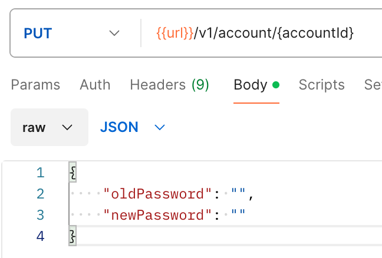
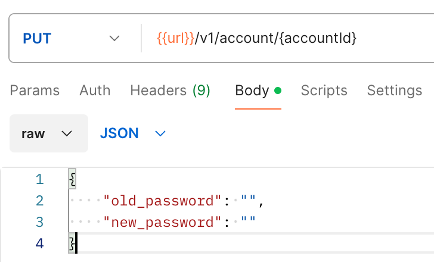
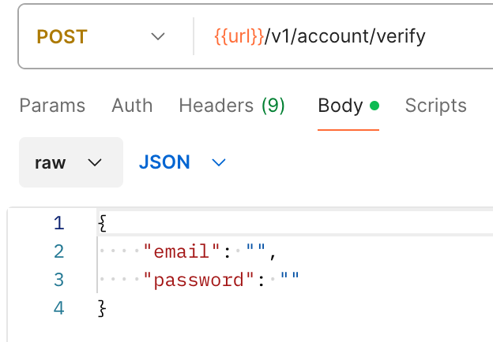
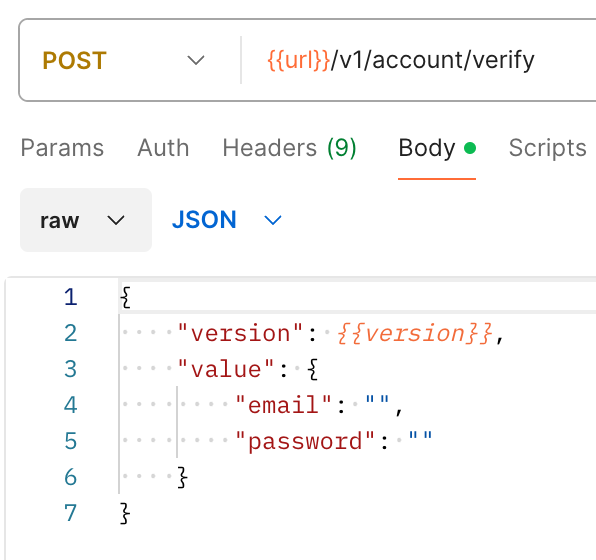
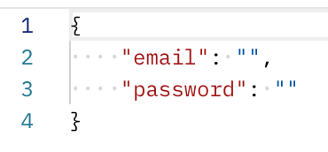
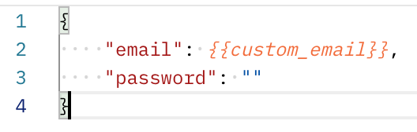
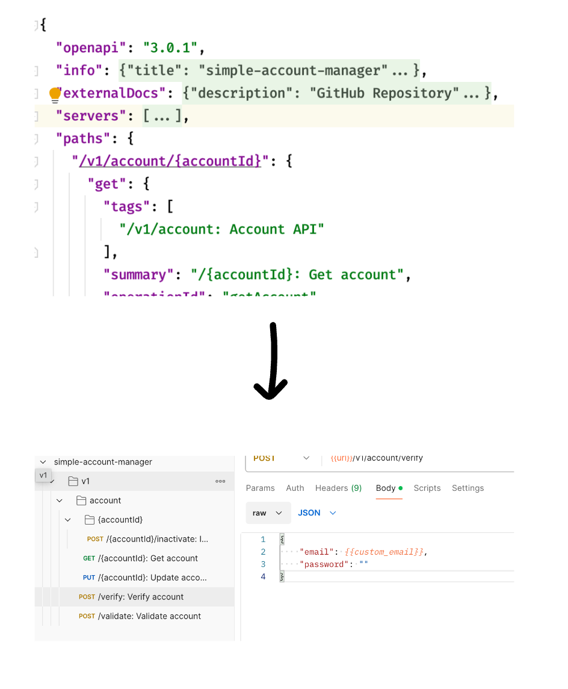

## Summary

This project is a library for generating **OpenAPI 3.0** specification from a TypeScript project.

---
## Usage
This library is designed to be used in a TypeScript project. The following steps are required to generate an OpenAPI 3.0 specification.
1. Put openapi.json into resources dir in the root of the project.
2. Use ts module of converter like below:
```typescript
import OpenApiParser from "@/parser/OpenApiParser";
import OpenAPIToPostmanImportFileConverter from "@/converter/postman/OpenAPIToPostmanImportFileConverter";
import PostmanConvertConfigures from "@/converter/postman/PostmanConvertConfigures";
import CaseMode from "@/type/postman/constant/CaseMode";
import {writeNewFile} from "@/util/FileUtil";

const openAPISpecification = OpenApiParser.parse('./resources/openapi.json');
const configures = new PostmanConvertConfigures("{{url}}", CaseMode.CAMEL); 
const converter = new OpenAPIToPostmanImportFileConverter(openAPISpecification, configures);

const path = `${process.cwd()}/static/postman.json`
const converted = converter.convert();
writeNewFile(path, JSON.stringify(converted, null, 2));
```

---

## Options

### Choose case mode for key of parameters
```typescript
const configures = new PostmanConvertConfigures("{{url}}", CaseMode.SNAKE); 
```

#### As is


#### To be



### Exclude Path
```typescript
configures.addExcludePaths(["/foo", "/bar", "/"]);
```
This options will be support for excluding as a using asterisk soon.

### Wrapping Request Body
```typescript
configures.defaultBodyWrapper((path, method, body) => {
    return {
        version: "{{version}}",
        value: body
    } as IPostmanRequestBody;
});
```

#### As is


#### To be



### Add Placeholders

```typescript
configures.addPlaceholders(new Map<string, any>([
    ['email', 'custom_email'],
]))
```

#### As is


#### To be


---

## Convert your openapi spec right now!!

